# Asiignment : Fleapo

### Overview

This project, developed demonstration of a dynamic and reusable web design using HTML, CSS, and JavaScript. ensuring a responsive and user-friendly experience. The project is crafted with a focus on dynamic content handling and efficient code reuse, reflecting modern web development practices.

### Objective

The primary goal of this assignment dynamic content integration and code reusability. The project showcases how to build a responsive layout while promoting maintainability and scalability through modular code.

### Key Features

- **Dynamic Content Handling:** Utilizes JavaScript to dynamically manage and render content, allowing the layout to adjust based on varying data inputs and scenarios.
- **Reusable Code:** Employs CSS and JavaScript functions to minimize redundancy, enhance maintainability, and simplify future updates.
- **Responsive Design:** Implements Flexbox properties to ensure the layout adapts seamlessly to different devices, including mobile and desktop views.
- **Efficient Layout Management:** Demonstrates how to manage complex layouts with minimal code repetition, leveraging reusable classes and functions.

### Technical Details

- **HTML:** Structured with semantic elements and dynamic content placeholders for easy data integration from APIs.
- **CSS:** Uses Flexbox for layout management with reusable classes and modular styles. Includes variables and mixins to ensure consistency and reduce code duplication.
- **JavaScript:** Handles dynamic content updates and interactions with reusable functions and modules for improved code efficiency.

### Screenshots

#### Web View

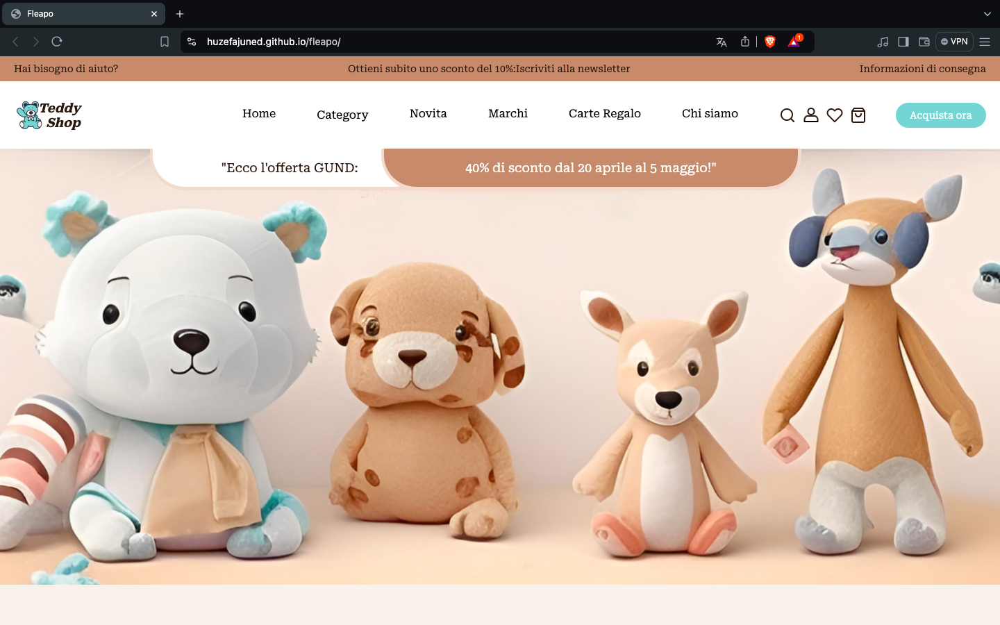
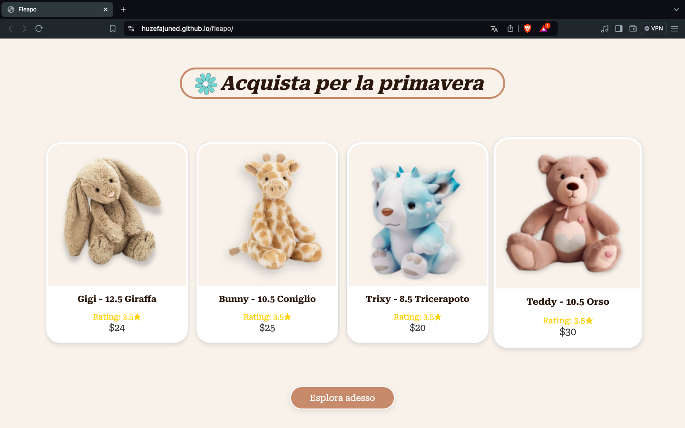
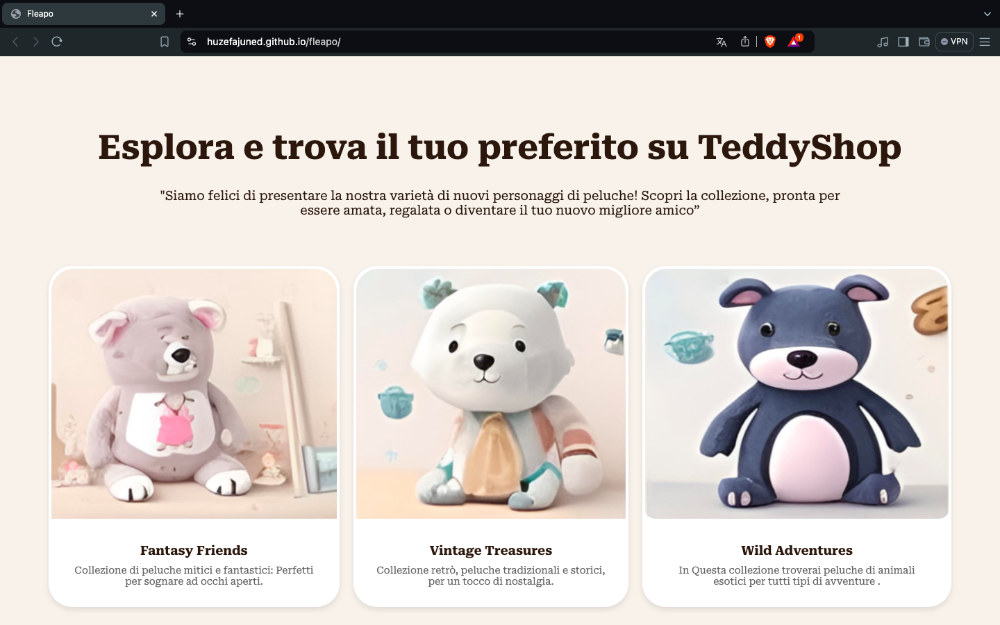
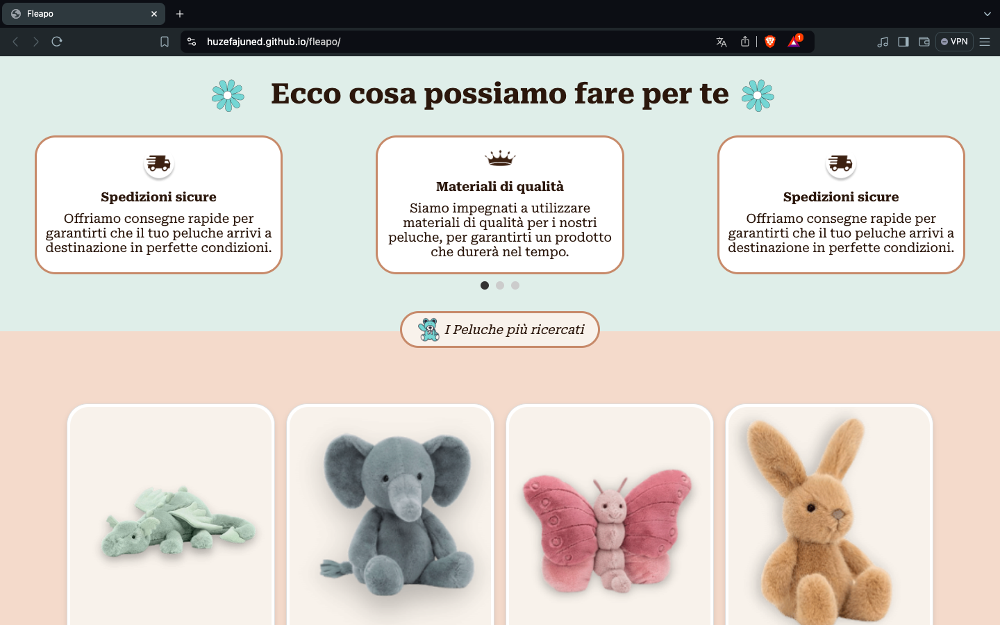
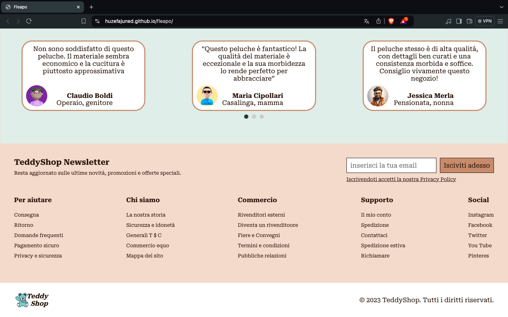
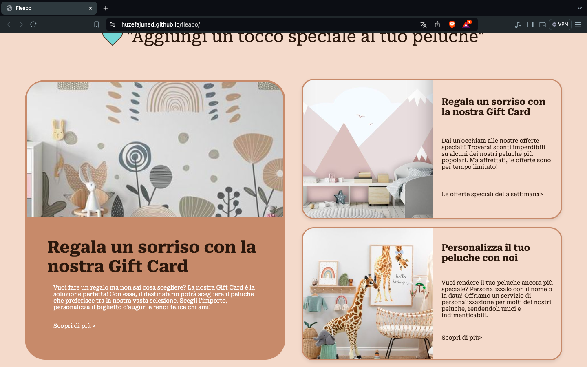


#### Mobile View


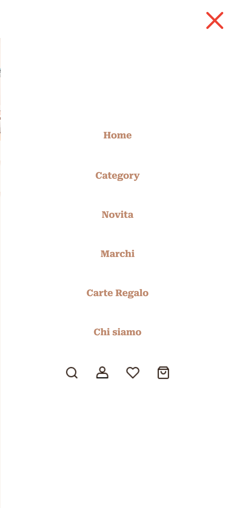
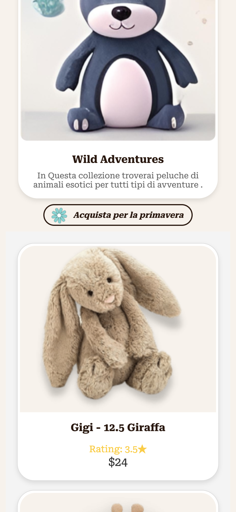
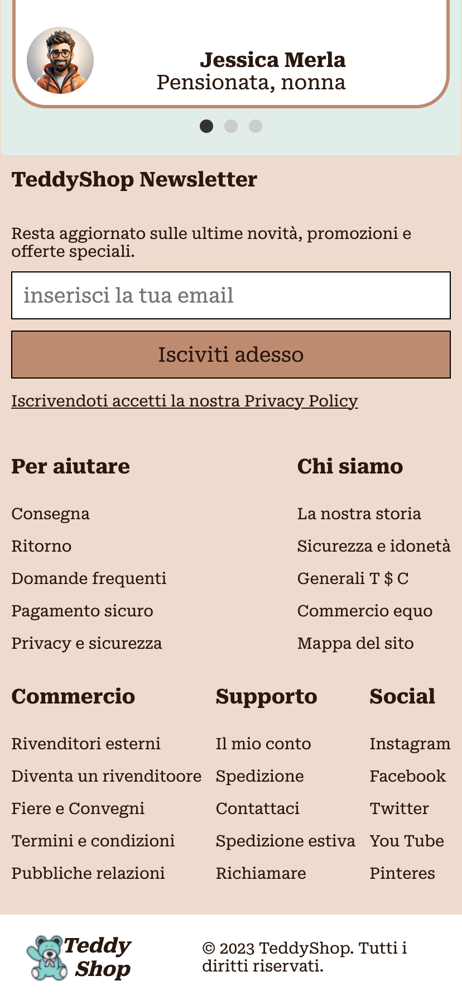
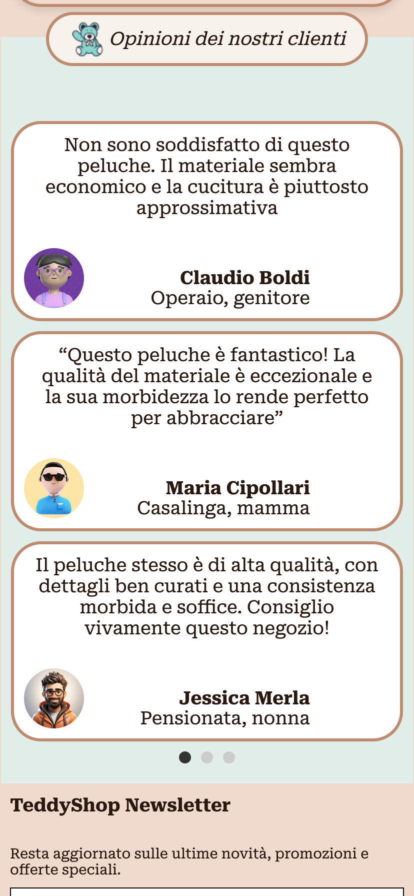
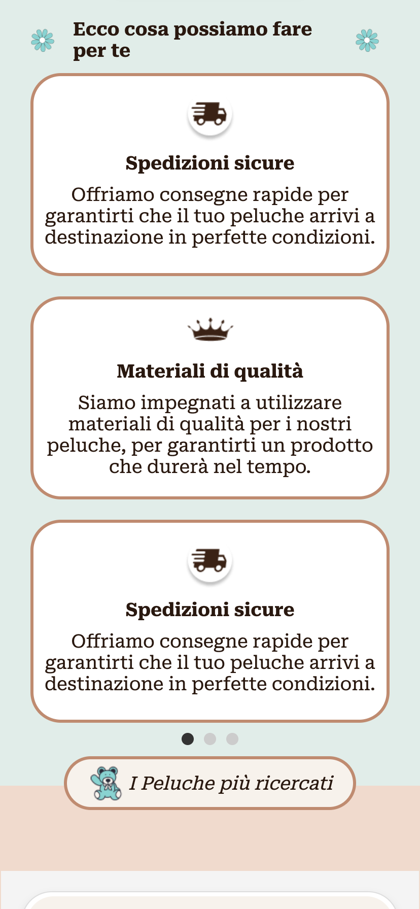
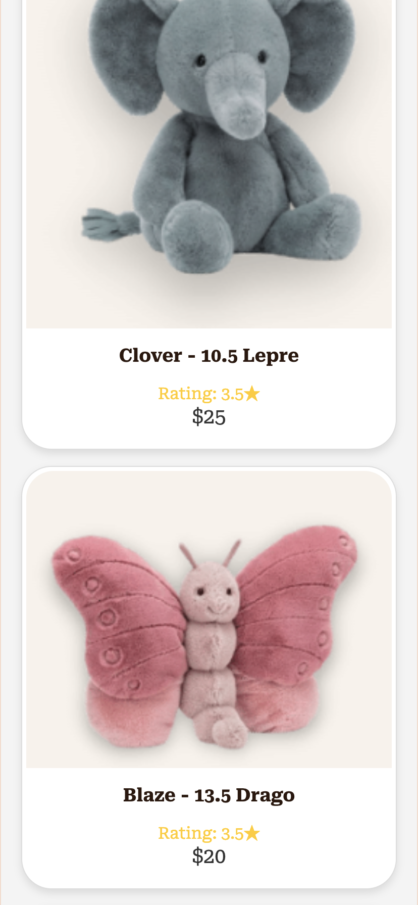


### Installation

To explore or modify the project locally, follow these steps:

1. **Clone the Repository:**

   ```bash
   git clone https://github.com/huzefajuned/fleapo.git
   ```

2. **Live Preview:**

   ```
   https://huzefajuned.github.io/fleapo
   ```
